<br clear="both">

<div align="center">
  
</div>

<br>

<div align="center">

# Hi 👋, I'm Egor

### C++ Developer · Systems Programming · Linux · Backend

<p>
  <a href="https://www.linkedin.com/in/egor-syharnikov-074516382/">
    
  </a>
  <a href="https://github.com/s3yato">
    
  </a>
</p>

</div>

---

## About Me

I'm a C++ developer focused on understanding how software works under the hood.

* C++20 and modern C++
* Systems programming and Linux
* Multithreading, concurrency and memory
* Networking and backend development
* CMake and build systems
* PostgreSQL and low-level infrastructure
* Robotics and embedded systems
* Open-source development

Currently looking for opportunities in **C++ / Systems / Backend / Infrastructure**.

---

## Featured Projects

### Atlas Runtime

A C++20 deterministic runtime for robotics and real-time oriented applications.

**Focus:**

* Event-driven architecture
* Scheduler
* Dataflow
* HAL
* RPC
* Vision
* Simulation
* Qt monitoring tools
* Cross-platform CI
* Automated testing

<a href="https://github.com/s3yato/Atlas-Runtime">
  
</a>

---

### cppnew

A **`cargo new`-like project scaffolding tool for C++**.

The goal is to make starting a new C++ project as simple as:

```bash
cppnew my-project
```

It generates the project structure, CMake configuration, tests and development tooling.

**Stack:** C++20 · CMake · CLI11 · GoogleTest · GitHub Actions

<a href="https://github.com/s3yato/cppnew-">
  
</a>

---

## Tech Stack

### Languages

<p>
  
</p>

### Systems & Backend

<p>
  
</p>

### Robotics & Embedded

<p>
  
</p>

### C++ Topics

```text
C++20 / Modern C++
        ↓
STL & Memory
        ↓
Concurrency & Multithreading
        ↓
Networking & IPC
        ↓
Linux Internals
        ↓
System Architecture & Performance
```

---

## Currently Learning

* Linux internals
* Network programming
* Advanced C++ concurrency
* System architecture
* Performance engineering
* Low-level design
* Open-source development

---

<div align="center">
  
</div>

---

## 🔥 GitHub Statistics

<div align="center">
  
    &nbsp;&nbsp;&nbsp;

  
</div>

<br>

## Contribution Graph

<div align="center">

<picture>
  <source
    media="(prefers-color-scheme: dark)"
    srcset="https://raw.githubusercontent.com/s3yato/s3yato/output/github-contribution-grid-snake-dark.svg"
  />
  <source
    media="(prefers-color-scheme: light)"
    srcset="https://raw.githubusercontent.com/s3yato/s3yato/output/github-contribution-grid-snake.svg"
  />
  
</picture>

</div>

---

## Interests

```text
C++ / Systems
Linux & Operating Systems
Backend & Infrastructure
Concurrency & Networking
Robotics & Embedded
Computer Vision
Open Source
Game Engines
```

---

## Let's Connect

<div align="center">

<a href="https://www.linkedin.com/in/egor-syharnikov-074516382/">
  
</a>

<a href="https://github.com/s3yato">
  
</a>

</div>

<br>

<div align="center">

<i>Building systems, breaking abstractions, learning how things work.</i>

</div>
